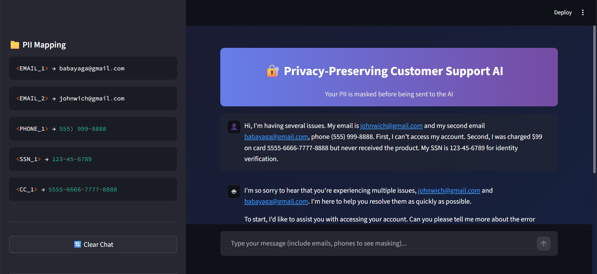

# 🔐 Privacy-Preserving Customer Support AI

A customer support chatbot that protects user privacy by masking PII before sending to LLMs.

## 🌟 Introduction
This intelligent chatbot acts as a secure shield for your customer data. When a user sends a message containing private details (like emails or phone numbers), the system automatically detects and masks this information before sending the query to an AI for processing. Once the AI responds, the system intelligently restores the original details, ensuring a seamless experience without sensitive data ever being exposed to third-party AI services.

## 🚀 Advantages
- **Zero Data Leakage**: Sensitive PII (Personally Identifiable Information) never leaves your local environment unmasked.
- **Regulatory Compliance**: Helps meet GDPR and CCPA requirements by minimizing data sharing with external processors.
- **Model Agnostic**: Can safely use any powerful public LLM (like Groq, OpenAI, or Anthropic) without privacy concerns.
- **Seamless UX**: Users get personalized, accurate responses without knowing their data was masked in the background.

## 💡 Use Cases
- **Customer Support**: Handle billing disputes and account recovery without exposing credit card limits or user IDs.
- **Healthcare Booking**: Schedule appointments while keeping patient contact details private.
- **HR & Internal Ops**: Automate employee queries involving payroll or personal records securely.
- **Financial Advisory**: Discussing general portfolio strategies without revealing specific account numbers or balances.



Run:
```
python customer_support_bot.py
```

---

## How The Pipeline Works

```
USER INPUT: "My email is john@gmail.com and phone is 555-123-4567"
      │
      ▼
┌─────────────────────────────────────────────────────────────┐
│  STEP 1: PII DETECTION                                      │
│  Regex patterns scan text and find:                         │
│  • EMAIL: "john@gmail.com"                                  │
│  • PHONE: "555-123-4567"                                    │
└─────────────────────────────────────────────────────────────┘
      │
      ▼
┌─────────────────────────────────────────────────────────────┐
│  STEP 2: MASKING                                            │
│  Replace PII with tokens:                                   │
│  • "john@gmail.com" → <EMAIL_1>                             │
│  • "555-123-4567" → <PHONE_1>                               │
│                                                             │
│  Masked: "My email is <EMAIL_1> and phone is <PHONE_1>"     │
└─────────────────────────────────────────────────────────────┘
      │
      ▼
┌─────────────────────────────────────────────────────────────┐
│  STEP 3: STORE MAPPING (Local Only)                         │
│                                                             │
│  mapping = {                                                │
│      "<EMAIL_1>": "john@gmail.com",                         │
│      "<PHONE_1>": "555-123-4567"                            │
│  }                                                          │
│                                                             │
│  ⚠️ This stays on YOUR server - never sent to LLM!          │
└─────────────────────────────────────────────────────────────┘
      │
      ▼
┌─────────────────────────────────────────────────────────────┐
│  STEP 4: SEND TO LLM (Groq)                                 │
│                                                             │
│  Only masked text sent: "My email is <EMAIL_1>..."          │
│  LLM never sees real data!                                  │
└─────────────────────────────────────────────────────────────┘
      │
      ▼
┌─────────────────────────────────────────────────────────────┐
│  STEP 5: LLM RESPONSE                                       │
│                                                             │
│  "I've sent a reset link to <EMAIL_1>. Verify via <PHONE_1>"│
└─────────────────────────────────────────────────────────────┘
      │
      ▼
┌─────────────────────────────────────────────────────────────┐
│  STEP 6: UNMASK                                             │
│  Replace tokens with original values using stored mapping:  │
│  • <EMAIL_1> → "john@gmail.com"                             │
│  • <PHONE_1> → "555-123-4567"                               │
└─────────────────────────────────────────────────────────────┘
      │
      ▼
FINAL OUTPUT: "I've sent a reset link to john@gmail.com. Verify via 555-123-4567"
```

---

## PII Types Detected

| Type | Token | Example Pattern |
|------|-------|-----------------|
| Email | `<EMAIL_1>` | `user@domain.com` |
| Phone | `<PHONE_1>` | `(555) 123-4567` |
| SSN | `<SSN_1>` | `123-45-6789` |
| Credit Card | `<CC_1>` | `4532-1234-5678-9012` |
| IP Address | `<IP_1>` | `192.168.1.1` |

---

## Modes

| Mode | Description |
|------|-------------|
| 1. Demo | Example pipeline (no API needed) |
| 2. Interactive | Chat with Groq LLM |
| 3. Quick Test | Single message test |

## Commands (Interactive Mode)

| Command | Action |
|---------|--------|
| `show` | View PII mapping |
| `clear` | Reset session |
| `quit` | Exit |

---

## Security Summary

| Data | Location | Sent to LLM? |
|------|----------|--------------|
| Original PII | Local mapping only | ❌ No |
| Masked text | Sent to Groq | ✅ Safe |
| Final output | Returned to user | ✅ Unmasked |
